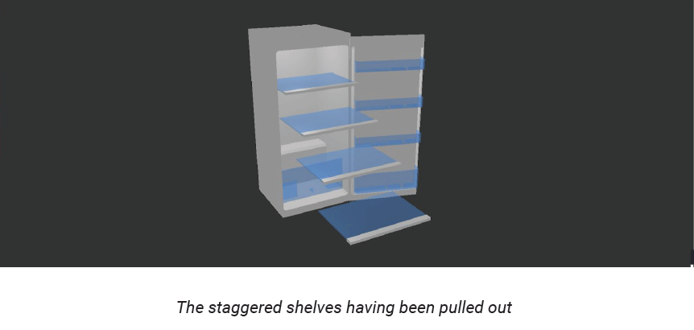
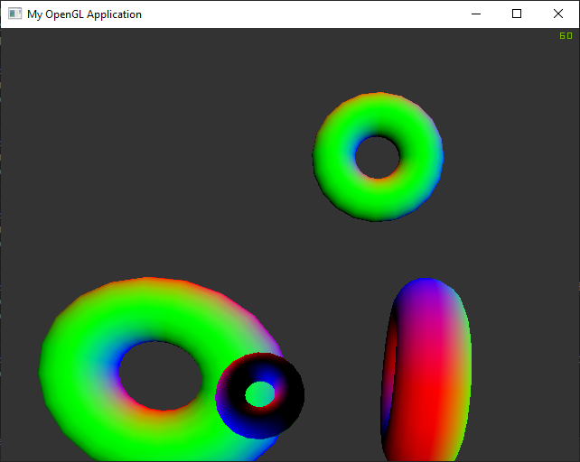
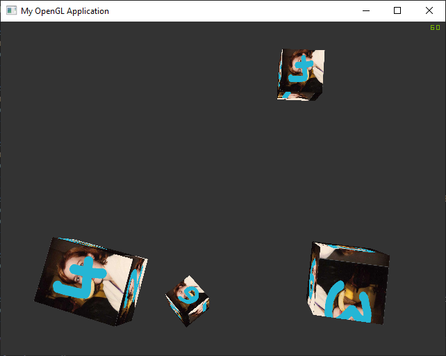
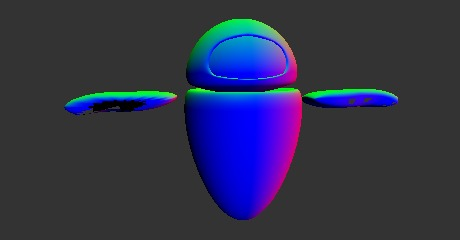

## Heriot-Watt F20GA 2020-21 Coursework

### F20GA: 3D Graphics and Animation

This course involved an introduction into computer graphics: matrices, cameras, lighting techniques, shaders, transformations, etc.

The coursework project involved three components:
- Create a 3D model with multiple components and render it (ideally using Maya & Arnold but Blender and others were allowed)
- Export a animation using Unreal
- **This repo:** Develop an *interactive component visualisation* using a C++ and a graphics API (we used OpenGL)

The `source.cpp` and shaders were provided as basic templates at the beginning of the course which we added to significantly to produce the final product. I've only included parts of the project I've developed.

I have also included the final coursework report (PDF) which explains what's going on better than I can, now.

**RE: Model loading:** I should definitely have used instancing.

---

I've also included some random screenshots from throughout the course that I find entertaining.

Instancing and colouring practice

I love X-Files. It took me a very, very long time to work out why one face was "larger" than the others - it was because I'd cropped the sides of the UX map.

I somehow ruined her arms horribly. I'm so sorry, Eve.
